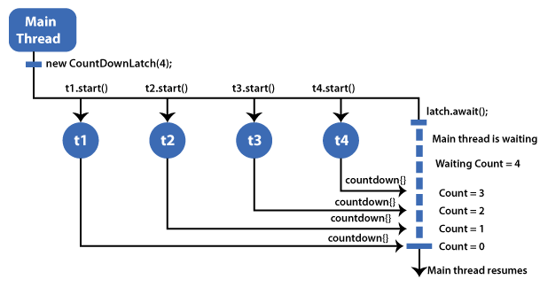
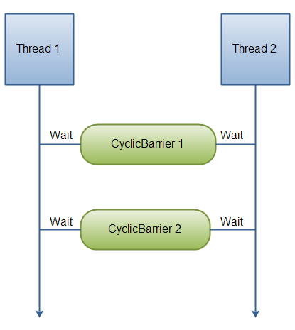
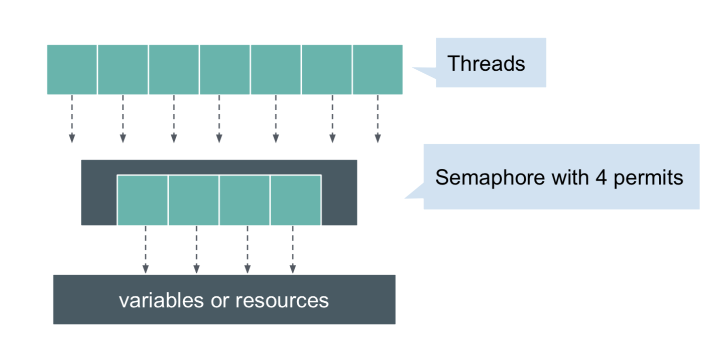
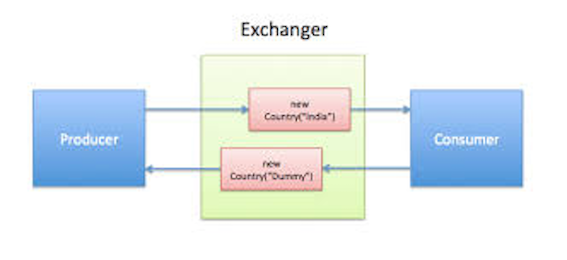
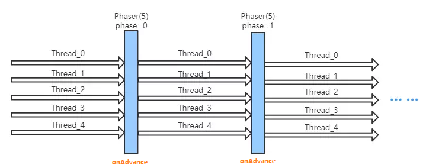
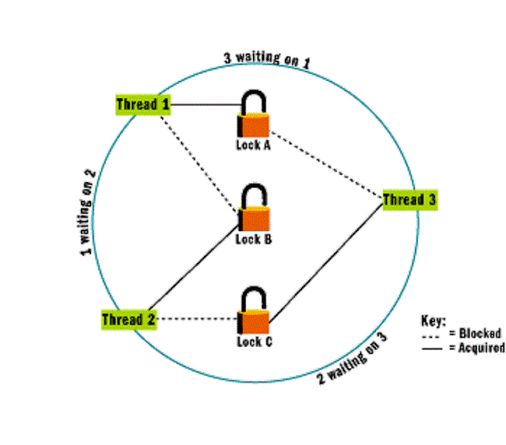

In Java, synchronizers are mechanisms used to coordinate the execution of multiple threads, ensuring that they work together in a controlled manner and can safely access shared resources. Synchronization can help avoid issues such as race conditions, where multiple threads access shared data concurrently, potentially causing inconsistent or incorrect results.

Java provides several built-in synchronizer classes and utilities, mostly in the java.util.concurrent package, that help manage thread coordination. Here are some of the key synchronizers in Java:

1. CountDownLatch
   * Purpose: Used to make one or more threads wait until a set of operations being performed in other threads completes.
   * How it works: A CountDownLatch starts with a given count and threads call await() to wait until the count reaches zero. Other threads can call countDown() to decrement the count.
   * Common Use Case: Waiting for all threads to finish a task before proceeding.
   * 
  
 
2. CyclicBarrier
   * Purpose: Used to synchronize a set of threads and ensure they all reach a common barrier point before continuing.
   * How it works: Threads call await() and are blocked until all threads reach the barrier. Once all threads have called await(), they are released to continue execution.
   * Common Use Case: When you need to divide a task into several parts, and each part must complete before moving on to the next stage.
   * 
   

3. Semaphore
   * Purpose: Controls access to a resource by limiting the number of threads that can access it concurrently.
   * How it works: A Semaphore maintains a set of permits. Threads can acquire permits via acquire() and release them via release(). If no permits are available, threads that attempt to acquire a permit will block until one becomes available.
   * Common Use Case: Managing access to a pool of resources, such as database connections or thread pools.
   * 
  
 
4. Exchanger
   * Purpose: Allows two threads to exchange objects at a synchronization point.
   * How it works: Two threads meet at the exchange point and exchange objects. If one thread arrives before the other, it will block until the other thread arrives.
   * Common Use Case: Used when two threads need to exchange data at a certain point in time.
   * 
   

5. Phaser
   * Purpose: A more flexible and advanced version of a CyclicBarrier, it allows multiple threads to wait for each other at different phases.
   * How it works: Threads register with the Phaser, and at each phase, they can synchronize and proceed together. The phaser can be advanced manually by the threads.
   * Common Use Case: When different sets of threads need to synchronize at different stages or phases.
   * 
   

6. Lock Interface
   * Purpose: Provides a more advanced way of locking compared to synchronized blocks or methods.
   * How it works: The Lock interface allows more flexible locking operations, such as trying to acquire a lock without blocking or interrupting a thread if it's waiting too long.
   * Common Use Case: When you need finer control over locks than what is provided by the synchronized keyword.
   * 