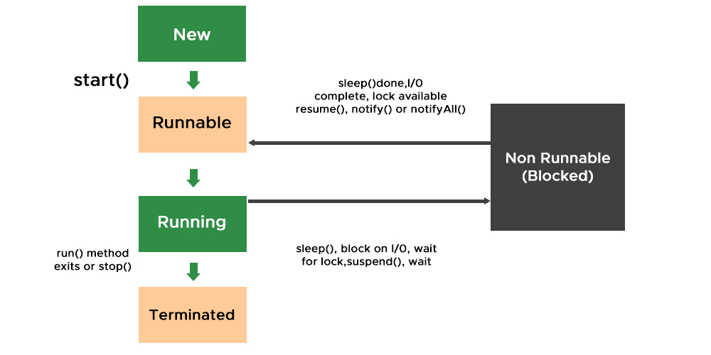

# Java Threads and Multithreading

**Multitasking** refers to the ability of an operating system or a program to perform multiple tasks concurrently. In Java, 
**Multithreading** is achieved through the use of **threads**. A thread is the smallest unit of execution within a program, and Java provides powerful capabilities to create, manage, and control threads for performing multiple tasks concurrently.

## 1. What is a Thread?
A **thread** is a lightweight process that executes code in a sequence of instructions. Each thread shares the same memory space but has its own execution stack and program counter.

In Java, multitasking is achieved by creating and running multiple threads.

## 2. Creating Threads in Java

Java provides two main ways to create and start a thread:

### 1. By Extending the `Thread` Class:
You can create a new thread by subclassing the `Thread` class and overriding its `run()` method.
### 2. By Implementing the `Runnable` Interface:
Another approach is to implement the `Runnable` interface and pass it to a `Thread` object.

#### When to Use Which Approach?
| **Approach**          | **When to Use** |
|-----------------------|----------------|
| **Thread Class**      | When you need full control over the thread and don’t need to extend another class. Less preferred due to single inheritance limitation. |
| **Runnable Interface** | When you want better modularity, flexibility, and reusability. Recommended for most cases as it allows implementing other interfaces or extending other classes. |
| **Lambda (Java 8+)**  | When using Runnable in a short, one-time-use scenario, making code more concise and readable. Ideal for functional programming style. |

## 3.Thread Life Cycle

A thread goes through various states during its lifetime:

1. **New**:
    - A thread is in the "new" state when it is created but has not yet started.

2. **Runnable**:
    - A thread enters the "runnable" state when the `start()` method is called.
    - It can be executed by the CPU, but the operating system decides when to actually execute it.

3. **Blocked**:
    - A thread enters the "blocked" state when it is waiting for a resource, such as I/O operations, to become available.

4. **Waiting**:
    - A thread enters the "waiting" state when it is waiting indefinitely for another thread to perform a particular action (e.g., `Thread.join()` or `Object.wait()`).

5. **Timed Waiting**:
    - A thread enters the "timed waiting" state when it is waiting for a specific period of time (e.g., `Thread.sleep()`).

6. **Terminated**:
    - A thread enters the "terminated" state when its `run()` method completes or it is explicitly stopped.

## 4. Types of Multitasking:

There are two main types of multitasking:

- **Process-based multitasking**: Different processes run concurrently. Each process has its own memory space. Examples include running multiple programs at the same time (e.g., a browser, word processor, etc.).

- **Thread-based multitasking**: Multiple threads run within a single process. Threads share the same memory space but have their own stack. Java uses **thread-based multitasking** for concurrent execution of tasks within a program.

## 5. Multithreading and Multitasking

### Multitasking:
- The operating system can handle multiple processes concurrently, each running in its own memory space.

### Multithreading:
- In a single process, multiple threads run concurrently and share the same memory space.

## 6.Advantages of Multithreading

- **Efficiency**:
    - Threads share resources, making it less costly to create and manage compared to processes.

- **Better CPU Utilization**:
    - Multithreading can keep the CPU busy by allowing it to switch between threads during periods of waiting (e.g., for I/O).

- **Simplified Program Design**:
    - For tasks like server programs, GUI applications, etc., multithreading can be a natural fit for managing different tasks concurrently.

## 7. Thread Communication

Java provides a way for threads to communicate with each other through inter-thread communication. This is useful when you want threads to cooperate or wait for certain conditions.

### Methods for Thread Communication:

- **wait()**:
    - Causes the current thread to release the lock and wait until another thread sends a notification.

- **notify()**:
    - Wakes up a single thread that is waiting on the object's monitor.

- **notifyAll()**:
    - Wakes up all threads that are waiting on the object's monitor.

## 8. Thread Synchronization

In Java, synchronization is used to control the access of multiple threads to shared resources. When multiple threads access shared resources, there could be conflicts or inconsistencies if not properly managed.

### Why Synchronization?

- **Data Integrity**:
    - If one thread is modifying data while another thread is reading the same data, synchronization ensures that the data is not corrupted.

- **Concurrency**:
    - Threads that need to access shared resources must wait for other threads to finish their operations.

### [Synchronizers](../synchronizers/synchronizers.md)

